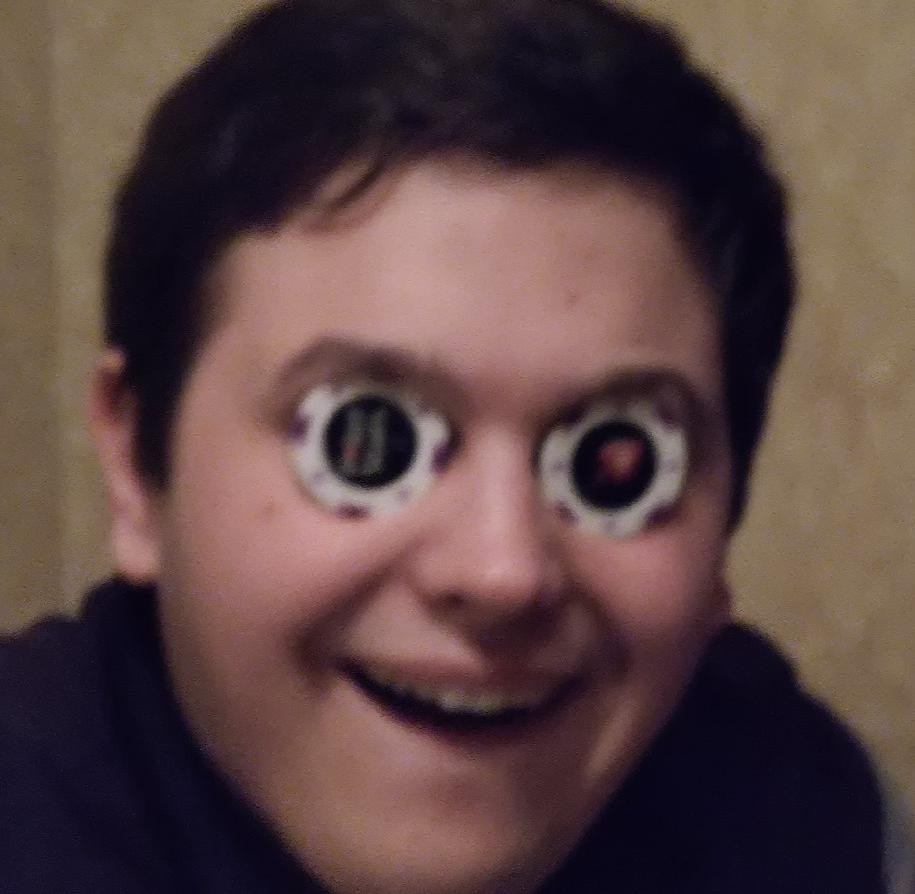
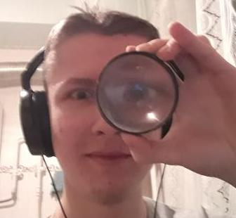
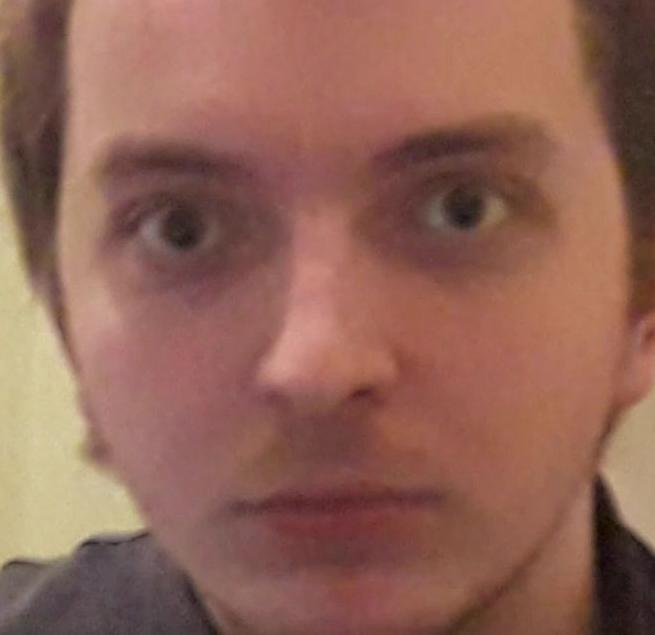

# Guitar app

Upcoming guitar app built with Flask/SQLAlchemy for backend, React ~~+Kotlin (WAT?)~~ for frontend
and with a pinch of love ~♥!.

We will provide a SaaS that includes a web site in bundle with backend API, all powered by AWS. You
can see full list of planned features in [PRD](docs/PRD.md).

## Things we will be definitely using

- Flask + SQLAlchemy for backend
- React for frontend
- AWS for hosting
- Automated PR & commit builds
- Unit testing

## Things we are going to implement (or not)

- CI/CD
- Docker image for service
- AWS resources configuration through Terraform 
- Corporative mail service
- Full fledged REST API for bots
- Telegram/VK/Discord bot

## How to build

We have two parts of our project, a rearguarde and vanguarde one, for particular instructions please
refer to [how to's](docs/how-to-s.md) page.

## By the way

In our project we are bundled with a significant amount of [conventions](docs/conventions.md), feel
free to read them all if you're interested in.

Also, we're using kinda weird *cool* naming conventions, don't forget to take a look at [glossary](docs/glossary.md)
to understand what is going on.

## Our team/in cast

### Artem Bondar aka "Keter Curtis"

- Project Manager/DevOps Engineer/Full Stack Developer/Software Architect (wannabe)/~~Secretary~~

### Yaroslav Bondarev aka "Evil Yarek"

- Project Initiator/Full Stack Developer/Python ~~guru~~ Team Hive Mind/Team Spirit Holder &
  Spiritual Mastermind

### Konstantin Kukushkin aka "Kost Metallist"

- Backend Developer/Database Developer & Administrator/DevOps Engineer/~~Wishmaster~~ Docker Master

### Valentin Alexandrov aka "Nagibator Lalok"

- Frontend Developer/Machine Learning Engineer/~~Outsource~~ Anonymous (?) Data Scientist

