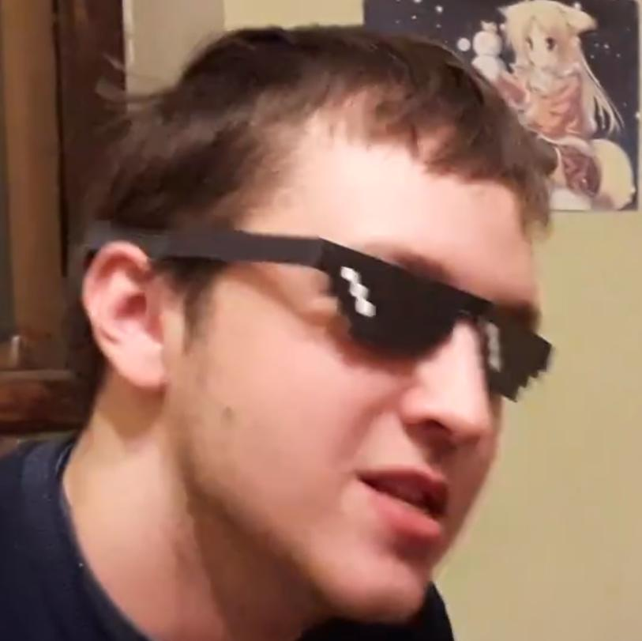
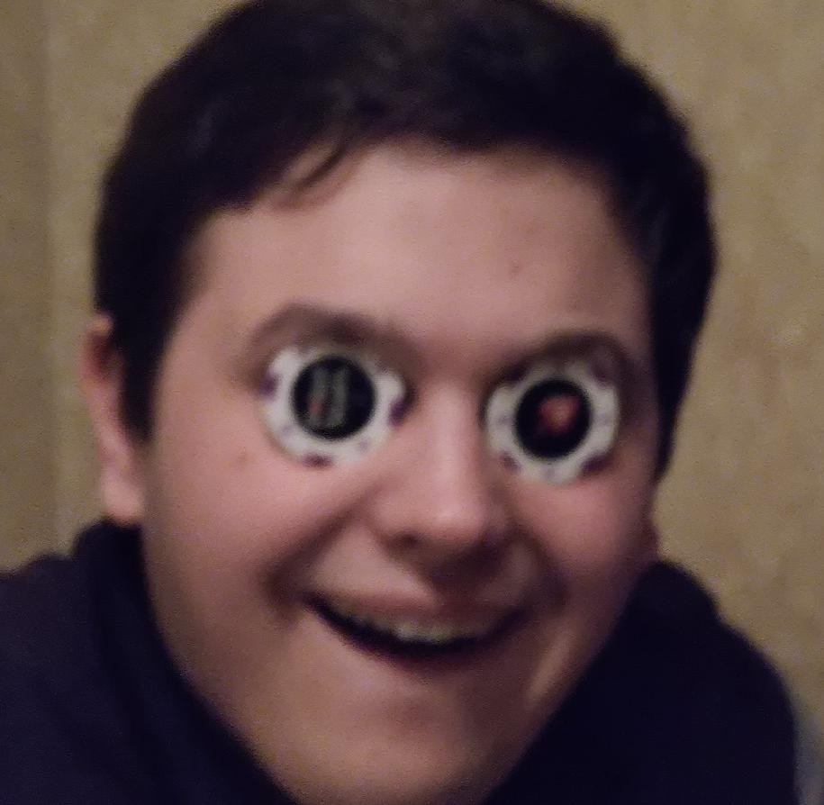
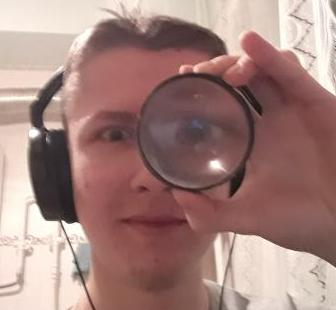

# Guitar app

Upcoming guitar app built with Flask/SQLAlchemy, a bit of frontend (under decision) and with a pinch
of love.

## Plan

Provide a SaaS containing of web site and mobile app (probably), all powered by AWS.
You can see full list of planned features in [PRD](docs/PRD.md) and list of planned
technologies [here](docs/technical-specifications.md).

## Development

The project is intended to be built inside the Python virtual environment. It is considered as a 
good practice to place all the dependencies for a particular application in separate workspace.
Instead of directly using `venv` module to manipulate virtual environments, one is obliged to 
utilize the `pipenv` high-level wrapper around `venv` tool. Please refer to this 
[page](docs/how-to.md) for additional information.

## Our team/in cast

### Artem Bondar aka "Keter Curtis"

- Project Manager/DevOps Engineer/Full Stack Developer/Software Architect (wannabe)/~~Secretary~~

### Yaroslav Bondarev aka "Evil Yarek"

- Project Initiator/Full Stack Developer/Python ~~guru~~ Team Hive Mind/Team Spirit Holder &
  Spiritual Mastermind

### Konstantin Kukushkin aka "Kost Metallist"

- Backend Developer/Database Developer & Administrator/DevOps Engineer/~~Wishmaster~~ Docker Master

 

### Valentin Alexandrov aka "Nagibator Lalok"

- Frontend Developer/Machine Learning Engineer/~~Outsorce~~ Anonymous (?) Data Scientist

 
