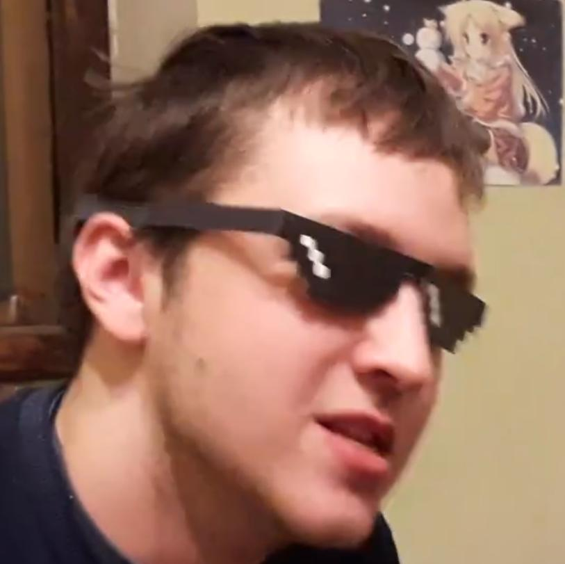
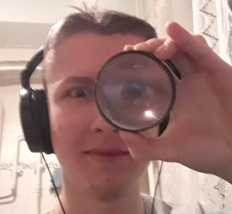

# Our team/in cast

## Artem Bondar aka "Keter Curtis"

- Project Manager (main)
- Frontend Developer (main)
- Backend Developer (supporting)
- DevOps Engineer (supporting)
- Software Architect (wannabe)
- ~~Secretary (in reality)~~

## Konstantin Kukushkin aka "Kost Metallist"

- Backend Developer (main)
- Database Developer & Administrator (main)
- DevOps Engineer (supporting)
- ~~Wishmaster~~ Docker Master (idea stakeholder)

Held `Der Großheldarbeiter` title during Aug-Nov of 2020 and for May 2021.

## Yaroslav Bondarev aka "Evil Yarek"

- Project Initiator (the Man the Cause of the Project)
- Full Stack Developer (we thought him to be, but he didn't)
- Python ~~guru~~ Team Hive Mind (100% eco-friendly mid python without any GMO)
- Team Spirit Holder & Spiritual Mastermind (brought us only Quality Humor, TM)

Achieved first ~~blood~~ pull request [#1](https://github.com/lateinit-apps/guitar-app/pull/1) with
`bozzyk-branch` :c.

Held `Der Großheldarbeiter` title for December 2020 for participating in New Year 2020 event.

Left us, but not forgotten.

## Valentin Alexandrov aka "Nagibator Lalok"

- Frontend Developer (we thought him to be, he did, but was defeated)
- Machine Learning Engineer (programming orientation)
- ~~Outsource~~ Anonymous (?) Data Scientist (social life position)

Held `Der Großheldarbeiter` title during May-Jul of 2020.

Left us and now is forgotten.

     
     
     
     
     

(honestly, a joke, we remember, of course)
