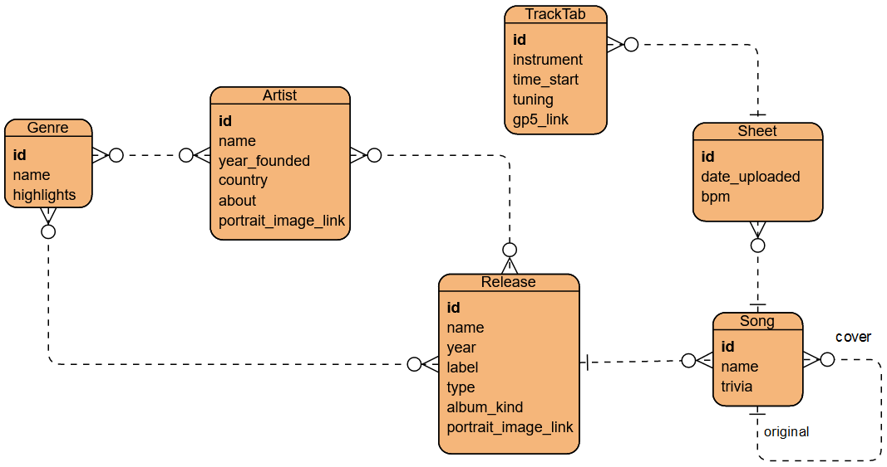

`Genre.highlights` -- краткая заметка об основных музыкальных особенностях жанра, популярности в определенное время и в определенной местности, сводка о типичных представителях.

`Song.trivia` -- текстовые данные об интересных особенностях зарождения идеи песни, ее записи, последующих воспроизведениях на концертах, аранжировках от других исполнителей и т.д.

`Release` -- таблица для хранения данных об отдельном элементе творчества исполнителя. Тип релиза указывается в `type`, и на данный момент выделены следующие типы:
- album
- single
- extended_play

Поскольку используется стратегия **Table-Per-Hierarchy**, поле `album_kind` окажется пустым в случае, если строка соответствует не альбому, а другому типу релиза. Данную особенность следует учитывать при работе с отображенными на таблицы классами.

`Release.album_kind` = тип альбома в зависимости от места записи, сольности/нет, каверности/нет (см. [таксономию](https://ru.wikipedia.org/wiki/%D0%9C%D1%83%D0%B7%D1%8B%D0%BA%D0%B0%D0%BB%D1%8C%D0%BD%D1%8B%D0%B9_%D0%B0%D0%BB%D1%8C%D0%B1%D0%BE%D0%BC#%D0%9A%D0%BB%D0%B0%D1%81%D1%81%D0%B8%D1%84%D0%B8%D0%BA%D0%B0%D1%86%D0%B8%D1%8F_%D0%BF%D0%BE_%D0%BE%D0%B1%D1%8A%D1%91%D0%BC%D1%83)). На данный момент предлагается выделить следующие типы: 
- концертный
- студийный
- сборник 
- сольный 
- трибьют

`TrackTab.gp5` = BLOB или ссылка на место в файловой системе (окончательно не утверждено).

Из вики про синглы: *"... can be released for sale to the public in a variety of different formats. In most cases, a single is a song that is released separately from an album, although it usually also appears on an album"*. Значит, песня, классифицирующаяся как сингл, может как иметь отношение к альбому, так и не иметь. Для этого в случае  сущности `Release` имеется самореференция, разным концам которой соответствуют пометки `included_releases`, что соответствует тем релизам, которые рассматриваются как подчиненные данному, и `embracing_release`, который следует понимать как агрегирующий данный.
